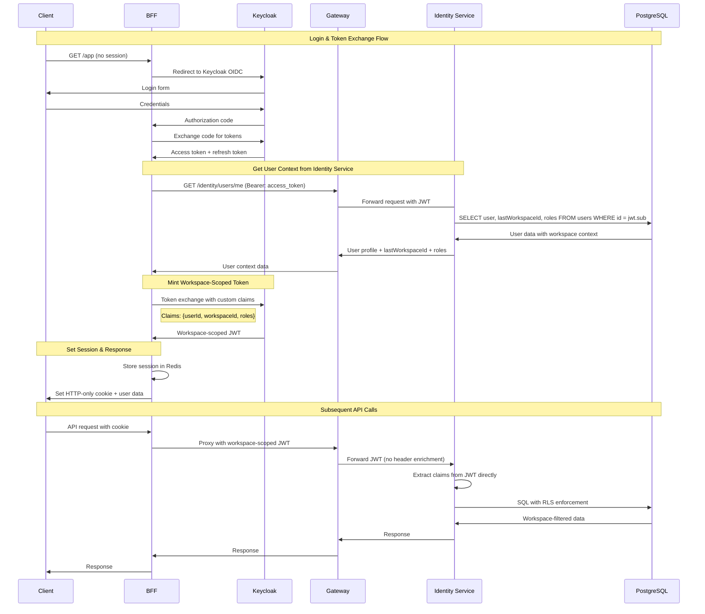

# Auth Flow (BFF + Gateway + Keycloak + Services)

This document describes the end‑to‑end authentication & authorization flow for our multi‑workspace SaaS:

- **Clients:** Next.js Web, iOS (Swift)
- **Edge:** **Spring Boot BFF** (only public app entry)
- **Auth Server:** **Keycloak** (one instance per environment)
- **Egress:** **Spring Cloud Gateway** (single private egress to backend)
- **Services:** `identity-service`, `transactions-service` (and others)
- **State:** **Redis** (BFF sessions + small roles cache)
- **DB:** **Postgres** with **Row‑Level Security (RLS)** per `workspace_id`

---

## High‑Level Principles

- **No tokens in the browser/app.** Clients hold only a **HTTP‑only session cookie**.
- **BFF owns sessions** and **refresh token**; performs **Token Exchange** to mint short‑lived **workspace‑scoped access tokens**.
- **Gateway validates & relays** workspace‑scoped JWTs to services.
- **Services authorize from JWT claims** (`sub`, `workspaceId`, `roles`) and DB enforces **RLS**.
- **Single egress:** All app API calls are **BFF → Gateway → Services** (no direct service exposure).

---

## Networks & Deployment Topology

**Single Private Network:**
- All containers run in one private Docker network
- Only BFF exposed to host machine (8080:8080) for development
- Internal service communication via container DNS names
- No external access to internal services (Gateway, Keycloak, Services, Databases)

**Local Development Setup:**
- BFF accessible at `http://localhost:8080` (only exposed service)
- All other containers communicate internally via private network
- Simplified networking for development efficiency

**Keycloak:** one instance per environment (dev/test/prod), each with its own DB, issuer URL, clients, secrets.

Example hostnames:

- Prod: `https://auth.example.com/realms/prod`
- Test: `https://auth.test.example.com/realms/test`
- Dev: `https://auth.dev.example.com/realms/dev`

---

## Sequence Diagram (Login → Token Exchange → Scoped API Call)



---

## Keycloak Setup (per environment)

Each environment (dev, test, prod) has a **dedicated Keycloak instance** + Postgres DB. 

### Realm
- Create realm: `dev`, `test`, `prod`.

### Clients
- **bff-web**
  - Type: confidential
  - Flow: Authorization Code + Refresh
  - Redirect URIs: `https://app.dev.example.com/*` (per env)
  - Token Exchange: enabled
- **identity-service**
  - Type: bearer‑only
  - Audience: `identity-service`
- **transactions-service**
  - Type: bearer‑only
  - Audience: `transactions-service`

### Client Scopes
- **workspace-context**:
  - Protocol mappers:
    - `workspaceId` → claim `workspaceId`
    - `roles` → claim `roles` (array)
  - Added on Token Exchange

### Lifetimes
- **Access Tokens (workspace‑scoped):** 5 minutes
- **Refresh Tokens:** 12h–24h
- **BFF Session TTL in Redis:** idle 12h, absolute 7d

---

## BFF (Spring Boot)

- **Responsibilities**:
  - Manage user login/logout.
  - Hold refresh token in Redis.
  - Store `currentWorkspaceId` in session.
  - Perform Token Exchange per workspace.
  - Call Gateway with workspace‑scoped token.
- **Redis session structure**:
  ```json
  {
    "userId": "abc123",
    "currentWorkspaceId": "ws456",
    "refreshToken": "...",
    "rolesCache": { "ws456": ["owner", "editor"], "exp": "2025-08-20T12:00Z" }
  }
  ```

---

## Gateway (Spring Cloud Gateway)

- **JWT validation** via Spring Security (issuer-uri per env).
- Global filters:
  - `TokenRelay`
  - `RemoveRequestHeader=Cookie`
- Routes:
  - `/identity/** → identity-service`
  - `/transactions/** → transactions-service`
- Only reachable from BFF’s private network.

---

## identity-service

- Resource server; validates JWT `aud=identity-service`.
- Endpoints:
  - `GET /me/preferences → { lastWorkspaceId }`
  - `PATCH /me/preferences { lastWorkspaceId }`
  - `GET /me/{workspaceId}/roles → [ ... ]`

---

## transactions-service

- Resource server; validates JWT `aud=transactions-service`.
- Enforces:
  - Request path workspace == claim `workspaceId`
  - Method roles via `@PreAuthorize`
- **Postgres RLS**:
  - `ALTER TABLE transactions ENABLE ROW LEVEL SECURITY;`
  - Policy example:
    ```sql
    CREATE POLICY ws_isolation ON transactions
      USING (workspace_id = current_setting('app.workspace_id')::uuid);
    ```
  - Spring sets `SET LOCAL app.workspace_id = :jwt.workspaceId` per connection.

---

## Redis Usage

- Session store for BFF (Spring Session Redis).
- Short cache for `(userId, workspaceId) → roles` (TTL ~5m).

---

## Postgres Usage

- Separate Postgres DB for:
  - **Keycloak** (per env).
  - **App services** (identity, transactions).
- RLS ensures **defense in depth**; services must pass workspace claim into DB session var.

---

## Summary

1. **Clients** only see cookies → safe.
2. **BFF** manages refresh + workspace context.
3. **Keycloak** handles login + token exchange.
4. **Gateway** enforces token validity.
5. **Services** enforce workspace auth via claims + RLS.
6. **Redis** caches sessions + roles for efficiency.
7. **Postgres** enforces final row‑level isolation.

This pattern scales cleanly to dev/test/prod, isolates envs, and provides strong security at each layer.
