# Authentication Flow Architecture

## Overview
This document describes the OAuth2/OpenID Connect authentication flow using Keycloak as the identity provider in a microservices architecture with Auth Gateway pattern for session-to-JWT orchestration.

## Authentication Flow Diagram

```mermaid
sequenceDiagram
    participant User as 👤 User
    participant AuthGW as 🔐 Auth Gateway
    participant Keycloak as 🔐 Keycloak
    participant Redis as ⚡ Session Store
    participant InternalGW as 🚪 Internal Gateway
    participant Identity as 👤 Identity Service
    participant Transactions as 💰 Transactions Service
    participant IdentityDB as 🗄️ Identity DB
    participant TransactionsDB as 🗄️ Transactions DB

    Note over User,TransactionsDB: 1. Sign In Flow with User Context
    User->>AuthGW: Access protected resource
    AuthGW-->>User: Redirect to Keycloak login
    User->>Keycloak: Login with credentials
    Keycloak-->>User: Auth code callback
    User->>AuthGW: Callback with auth code
    AuthGW->>Keycloak: Exchange code for basic JWT (userId only)
    Keycloak-->>AuthGW: Basic JWT with userId
    
    Note over AuthGW,IdentityDB: Get User's Workspace Context
    AuthGW->>InternalGW: Get user context with basic JWT
    InternalGW->>Identity: GET /users/me/context
    Identity->>IdentityDB: SET SESSION 'app.workspace_id' = NULL (admin query)
    Identity->>IdentityDB: SELECT user, lastWorkspaceId, roles, workspaces FROM users WHERE id = ?
    IdentityDB-->>Identity: User data + workspace memberships
    Identity-->>InternalGW: User profile + workspace context
    InternalGW-->>AuthGW: User context data
    
    AuthGW->>Keycloak: Exchange for workspace-scoped JWT (custom claims)
    Keycloak-->>AuthGW: Final JWT with userId + workspaceId + roles
    AuthGW->>Redis: Store session + workspace-scoped JWT
    AuthGW-->>User: Set session cookie

    Note over User,TransactionsDB: 2. API Call with Workspace Context
    User->>AuthGW: GET /api/transactions/recent (cookie)
    AuthGW->>Redis: Get workspace-scoped JWT from session
    AuthGW->>InternalGW: Forward with JWT Bearer token
    InternalGW->>Transactions: Route request with JWT
    Transactions->>Transactions: Extract workspaceId from JWT
    Transactions->>TransactionsDB: SET SESSION 'app.workspace_id' = 'workspace-123'
    Transactions->>TransactionsDB: SELECT * FROM transactions ORDER BY date DESC LIMIT 10
    Note right of TransactionsDB: RLS: WHERE workspace_id = current_setting('app.workspace_id')
    TransactionsDB-->>Transactions: Workspace-filtered results
    Transactions-->>InternalGW: Transaction data
    InternalGW-->>AuthGW: Pass through
    AuthGW-->>User: JSON response
```



## Security Standards Alignment

### ✅ OAuth2/OpenID Connect Compliance
- **Authorization Code Flow**: Industry standard for web applications
- **PKCE Support**: Code challenge/verifier for enhanced security
- **JWT Tokens**: Stateless, cryptographically signed tokens
- **Refresh Token Rotation**: Enhanced security with token rotation
- **Scope-based Authorization**: Fine-grained permission control

### ✅ Zero Trust Architecture
- **No Direct Service Access**: All services private except Auth Gateway
- **Token Validation at Internal Gateway**: Central authentication checkpoint
- **Service-to-Service Authentication**: Internal JWT validation
- **Session Management**: Server-side session storage in Redis

### ✅ Security Headers & CORS
```http
# Security Headers (Auth Gateway should implement)
Strict-Transport-Security: max-age=31536000; includeSubDomains
X-Content-Type-Options: nosniff
X-Frame-Options: DENY
X-XSS-Protection: 1; mode=block
Content-Security-Policy: default-src 'self'

# CORS Configuration
Access-Control-Allow-Origin: https://yourapp.com
Access-Control-Allow-Credentials: true
Access-Control-Allow-Methods: GET, POST, PUT, DELETE
Access-Control-Allow-Headers: Authorization, Content-Type
```

## Token Validation Strategy

### At Internal Gateway Level
```yaml
# Internal Gateway JWT Validation Configuration
security:
  oauth2:
    resourceserver:
      jwt:
        issuer-uri: http://keycloak:8090/realms/dev
        jwk-set-uri: http://keycloak:8090/realms/dev/protocol/openid-connect/certs
```

## Session Management

### Auth Gateway Session Strategy
- **Server-side Sessions**: Stored in Redis for scalability
- **HTTP-only Cookies**: Prevent XSS attacks
- **Secure Flag**: HTTPS-only transmission
- **SameSite**: CSRF protection
- **Session Timeout**: Configurable expiration

### Redis Session Store
- **Session Data**: User ID, current workspace, refresh token, roles cache
- **TTL**: Idle and absolute expiration times
- **Connection**: Auth Gateway connects to Redis for session operations

### Session Flow
1. User accesses a protected resource.
2. Auth Gateway checks for a valid session in Redis.
3. If no valid session, respond with 401 Unauthorized and redirect to login.
4. After successful login, store session data in Redis with access and refresh tokens.
5. Set HTTP-only, Secure, SameSite cookie in the user's browser.
6. For subsequent requests, Auth Gateway validates the session using the cookie.
7. If the access token is expired, use the refresh token to obtain a new access token.
8. Update the session in Redis with the new access token.

## Authorization Matrix
| Role | Identity Service | Transactions Service | Internal Gateway Access |
|------|-----------------|---------------------|----------------|
| **user** | Read own profile | Read own transactions | Basic routes |
| **manager** | Read team profiles | Read team transactions | Manager routes |
| **admin** | Full access | Full access | All routes |

## Development Configuration

### Local Environment Variables
```env
# Keycloak Configuration
KEYCLOAK_REALM=dev
KEYCLOAK_CLIENT_ID=beaver-auth-gateway
KEYCLOAK_CLIENT_SECRET=your-client-secret
KEYCLOAK_ISSUER_URL=http://keycloak:8090/realms/dev

# Session Configuration  
REDIS_HOST=auth-redis
REDIS_PORT=6379
SESSION_TIMEOUT=3600
COOKIE_SECURE=false
COOKIE_DOMAIN=localhost

# Internal Gateway Configuration
INTERNAL_GATEWAY_URL=http://internal-gateway:8081
JWT_VALIDATION_ENABLED=true
```

### Auth Gateway Implementation Checklist
- [ ] OAuth2 Authorization Code Flow implementation
- [ ] Session management with Redis
- [ ] CSRF protection with SameSite cookies
- [ ] Token refresh mechanism
- [ ] Security headers implementation
- [ ] CORS configuration
- [ ] Error handling with proper HTTP status codes
- [ ] Logout functionality with session cleanup
- [ ] Rate limiting for authentication endpoints
- [ ] Audit logging for security events
