# Docker Container Architecture

This document outlines the local container setup for the Beaver microservices architecture.

## Container Network Topology

```mermaid
graph LR
    subgraph "Internet / Host Machine"
        Browsers[🌐 Browsers]
        DevTools[🛠️ Postman, etc.]
    end

    subgraph "Private Container Network"
        AuthGateway["🔐 auth-gateway<br/>8000:8000<br/>EXPOSED FOR DEVELOPMENT"]

        Keycloak[🔐 keycloak<br/>8080:8080]
        KeycloakDB[(🗄️ keycloak-db<br/>5432:5432<br/>PostgreSQL)]
        AuthRedis[(📦 auth-redis<br/>6379:6379)]

        InternalGateway[🚪 internal-gateway<br/>8001:8001<br/>INTERNAL ONLY]

        Identity[👤 identity-service<br/>8002:8002<br/>INTERNAL ONLY]
        Transactions[💰 transactions-service<br/>8003:8003<br/>INTERNAL ONLY]

        IdentityDB[(🗄️ identity-db<br/>5433:5432<br/>PostgreSQL)]
        TransactionsDB[(🗄️ transactions-db<br/>5434:5432<br/>PostgreSQL)]
    end

    Browsers --> AuthGateway
    DevTools --> AuthGateway

    AuthGateway --> Keycloak
    AuthGateway --> InternalGateway
    AuthGateway --> AuthRedis

    InternalGateway --> Identity
    InternalGateway --> Transactions

    Identity --> IdentityDB
    Transactions --> TransactionsDB

    Keycloak --> KeycloakDB

    classDef internet fill:#ffebee,color:#c62828
    classDef auth fill:#e8f5e8,color:#2e7d32
    classDef internal fill:#fff3e0,color:#e65100
    classDef database fill:#bbdefb,color:#0d47a1
    classDef cache fill:#ffcdd2,color:#b71c1c

    class Browsers,DevTools internet
    class AuthGateway auth
    class Keycloak,InternalGateway,Identity,Transactions internal
    class IdentityDB,TransactionsDB,KeycloakDB database
    class AuthRedis cache
```



## Network Security (Authentication Gateway Architecture)

### Single Private Network
- **Docker**: All containers run in one custom Docker bridge network with internal DNS resolution
- **Container isolation**: Only containers in the same network can communicate with each other
- **No external access**: Internal containers have no published ports to host machine
- **DNS resolution**: Containers communicate using container names (e.g., `http://keycloak:8080`)
(AWS equivalent: VPC with private subnets)

### Auth Gateway (Authentication Orchestration Layer)
- **Docker**: Single container with published port mapping `8000:8000` to host machine
- **External access**: Only this container is reachable from outside Docker network
- **Authentication role**: Converts session cookies to JWT tokens and manages auth state
- **Pass-through pattern**: Forwards authenticated requests to Internal Gateway
- **Session management**: Uses Redis container for distributed session storage
- **Auth boundary**: Separates public authentication (cookies) from private authentication (JWT)
(AWS equivalent: Application Load Balancer + ECS Task in public subnet)

### Internal Gateway (Service Routing Hub)
- **Docker**: Container with no published ports - internal access only via `internal-gateway:8001`
- **Routing responsibility**: Receives JWT-authenticated requests from Auth Gateway and routes to services
- **Service discovery**: Uses Docker DNS to forward requests to `identity:8002`, `transactions:8003`, etc.
- **Token validation**: Validates JWT tokens before forwarding to downstream services
- **Path-based routing**: Routes based on URL patterns (e.g., `/identity/*` → Identity Service)

### Business Services (Private Microservices)
- **Docker**: Containers with no published ports - only accessible within Docker network
- **Service discovery**: Containers find each other using Docker's built-in DNS (container names)
- **Database isolation**: Each service has dedicated PostgreSQL container with unique internal port
- **JWT consumption**: Services receive validated JWT tokens with user/workspace context
- **Network segmentation**: Cannot be accessed from host machine or external networks
(AWS equivalent: ECS Tasks in private subnets + RDS instances + ElastiCache)

## Request Flow Architecture

### Client Request Journey
```
Client Request (🍪 session cookie)
    ↓
┌─────────────────────────────────────────┐
│           Auth Gateway :8000          │
│    Authentication Orchestrator         │
│                                         │
│  1. Extract session from Redis          │
│  2. Get JWT from session                │
│  3. Add Authorization header            │
│  4. Forward request to Internal Gateway  │
└─────────────────────────────────────────┘
    ↓ (🎟️ JWT Bearer token)
┌────────────────────���────────────────────┐
│         Internal Gateway :8001         │
│       Service Router                   │
│                                         │
│  1. Validate JWT token                  │
│  2. Route by path pattern               │
│  3. Forward to appropriate service      │
└─────���───────────────────────────────────┘
    ↓ (🎟️ Forward JWT unchanged)
┌─────────────────────────────────────────┐
│    Microservices :8002, :8003, etc.    │
│       Business Logic                    │
│                                         │
│  1. Extract user context from JWT       │
│  2. Set database session variables      │
│  3. Execute business logic              │
│  4. Return response                     │
└─────────────────────────────────────────┘
```

### Response Journey
```
Service Response (JSON)
    ↓
Internal Gateway (passes through unchanged)
    ↓  
Auth Gateway (passes through unchanged)
    ↓
Client receives identical response
```

## Development vs Production

### Development (Local Docker)
```
Host Machine → Auth Gateway :8000 → Internal Gateway :8001 → Services :800X
    🍪              🎟️           🚪            🔓
 (session)        (JWT)      (route)     (business logic)
```

**No Load Balancer Needed Locally:**
- Auth Gateway port 8000 exposed to localhost for testing
- Direct access: `curl http://localhost:8000/api/identity/users/me`
- Auth Gateway orchestrates: cookie → JWT → forward to internal gateway
- Simplified for development efficiency

### Production (Cloud)
```
Internet → Load Balancer → Auth Gateway → Internal Gateway → Services
    🌐           🔀           🎟️      🚪        🔓
               (SSL)      (orchestrate) (route) (execute)
```


## Container Configuration

### Individual Service Dockerfiles
Each service will have its own Dockerfile and be built/managed individually through IntelliJ Services:

**Service Structure:**
```
services/
├── auth-gateway/
│   ├── Dockerfile
│   ├── docker-compose.local.yml
│   ├── src/
│   └── application-local.yml
├── internal-gateway/
│   ├── Dockerfile
│   ├── src/
│   └── application-local.yml
├── identity-service/
│   ├── Dockerfile
│   ├── docker-compose.local.yml
│   ├── src/
│   └── application-local.yml
├── transactions-service/
│   ├── Dockerfile
│   ├── docker-compose.local.yml
│   ├── src/
│   └── application-local.yml
└── keycloak/
    ├── Dockerfile
    ├── docker-compose.local.yml
    ├── realm-config/
    │   ├── dev-realm.json
    │   └── client-configs.json
    └── themes/ (optional custom themes)
```

### Local Development Database Strategy
Each service manages its own PostgreSQL database via Docker Compose:

**Example: `identity-service/docker-compose.local.yml`**
```yaml
version: '3.8'
services:
  identity-db:
    image: postgres:16
    container_name: identity-db
    environment:
      POSTGRES_DB: identity_db
      POSTGRES_USER: identity_user
      POSTGRES_PASSWORD: identity_password
    ports:
      - "5434:5432"
    volumes:
      - identity_db_data:/var/lib/postgresql/data
    networks:
      - beaver-network

volumes:
  identity_db_data:

networks:
  beaver-network:
    external: true
```

**Example: `transactions-service/docker-compose.local.yml`**
```yaml
version: '3.8'
services:
  transactions-db:
    image: postgres:16
    container_name: transactions-db
    environment:
      POSTGRES_DB: transactions_db
      POSTGRES_USER: transactions_user
      POSTGRES_PASSWORD: transactions_password
    ports:
      - "5435:5432"
    volumes:
      - transactions_db_data:/var/lib/postgresql/data
    networks:
      - beaver-network

volumes:
  transactions_db_data:

networks:
  beaver-network:
    external: true
```

**Example: `auth-gateway/docker-compose.local.yml`**
```yaml
version: '3.8'
services:
  auth-redis:
    image: redis:7-alpine
    container_name: auth-redis
    ports:
      - "6379:6379"
    networks:
      - beaver-network

networks:
  beaver-network:
    external: true
```

**Example: `keycloak/docker-compose.local.yml`**
```yaml
version: '3.8'
services:
  keycloak-db:
    image: postgres:16
    container_name: keycloak-db
    environment:
      POSTGRES_DB: keycloak_dev
      POSTGRES_USER: keycloak_user
      POSTGRES_PASSWORD: keycloak_password
    ports:
      - "5433:5432"
    volumes:
      - keycloak_db_data:/var/lib/postgresql/data
    networks:
      - beaver-network

  keycloak:
    build: .
    container_name: keycloak
    environment:
      KC_DB: postgres
      KC_DB_URL: jdbc:postgresql://keycloak-db:5432/keycloak_dev
      KC_DB_USERNAME: keycloak_user
      KC_DB_PASSWORD: keycloak_password
      KEYCLOAK_ADMIN: admin
      KEYCLOAK_ADMIN_PASSWORD: admin_password
      KC_HTTP_PORT: 8080
    ports:
      - "8090:8080"
    volumes:
      - ./realm-config:/opt/keycloak/data/import
    command: ["start-dev", "--import-realm"]
    depends_on:
      - keycloak-db
    networks:
      - beaver-network

volumes:
  keycloak_db_data:

networks:
  beaver-network:
    external: true
```

**Example: `keycloak/Dockerfile`**
```dockerfile
FROM quay.io/keycloak/keycloak:25.0

# Copy custom realm configurations
COPY realm-config/ /opt/keycloak/data/import/

# Copy custom themes (if any)
COPY themes/ /opt/keycloak/themes/

# Set production optimizations (optional for local dev)
# RUN /opt/keycloak/bin/kc.sh build
```

### Environment Variables Strategy
Each service uses Spring Boot profiles and environment-specific configuration:
- `application-local.yml` - Local development configuration  
- `application-test.yml` - Testing environment
- `application-prod.yml` - Production (not in repo)

**Example service configuration patterns:**
```yaml
# Database connection (each service connects to its own local DB)
spring:
  datasource:
    url: jdbc:postgresql://localhost:5434/identity_db  # Local port mapping
    username: identity_user
    password: identity_password

# Redis connection (Auth Gateway only)
  session:
    store-type: redis
  data:
    redis:
      host: localhost  # Local Redis via compose
      port: 6379

# Keycloak configuration
  security:
    oauth2:
      resourceserver:
        jwt:
          issuer-uri: http://localhost:8090/realms/dev  # Local Keycloak

# Internal service discovery (for containerized deployment)
internal-gateway:
  url: http://internal-gateway:8081  # Container-to-container communication
```
````markdown
## IntelliJ Services Management

### Service-Specific Infrastructure (Docker Compose)
Each service manages its own dependencies via `docker-compose.local.yml`:
- **keycloak** - Starts `keycloak` + `keycloak-db` (ports 8090:8080, 5433:5432)
- **auth-gateway** - Starts `auth-redis` (port 6379:6379)
- **identity-service** - Starts `identity-db` (port 5434:5432)
- **transactions-service** - Starts `transactions-db` (port 5435:5432)
- **internal-gateway** - No database dependencies

### Application Services (IntelliJ)
These will be Spring Boot applications managed through IntelliJ Services:
- **auth-gateway** - Built from Dockerfile, exposed port 8080:8080
- **internal-gateway** - Built from Dockerfile, internal port 8081
- **identity-service** - Built from Dockerfile, internal port 8082
- **transactions-service** - Built from Dockerfile, internal port 8083

## Development Workflow

### 1. Create Shared Network (One Time Setup)
```bash
# Create the shared Docker network that all services will use
docker network create beaver-network
```

### 2. Start Service Infrastructure
Each developer starts their required infrastructure via Docker Compose:

**For Keycloak (Shared Auth Infrastructure):**
```bash
cd services/keycloak/
docker-compose -f docker-compose.local.yml up -d
# This starts both keycloak-db and keycloak with realm import
```

**For Identity Service:**
```bash
cd services/identity-service/
docker-compose -f docker-compose.local.yml up -d
```

**For Transactions Service:**
```bash
cd services/transactions-service/
docker-compose -f docker-compose.local.yml up -d
```

**For Auth Gateway:**
```bash
cd services/auth-gateway/
docker-compose -f docker-compose.local.yml up -d
```

### 3. Run Services via IntelliJ Services
1. **Configure IntelliJ Services**: Add each service to IntelliJ's Services panel
2. **Build Dockerfiles**: Each service builds from its individual Dockerfile
3. **Network Configuration**: Ensure all services join the `beaver-network`
4. **Start Order**: Start services in dependency order:
   - **keycloak** (authentication provider - step 2)
   - Service databases (step 2)
   - **internal-gateway** (internal routing)
   - **identity-service** (user context)
   - **transactions-service** (business logic)
   - **auth-gateway** (public endpoint)

### 4. Development Benefits
**Environment Consistency:**
- Each environment (dev, staging, prod) has its own Keycloak instance with specific realm configurations
- Keycloak realm configurations are version-controlled and automatically imported
- Custom themes and branding per environment

**Per-Service Autonomy:**
- Each team can manage their own database schema migrations
- Independent database versions and configurations
- Isolated data for testing without affecting other services
- Keycloak configurations managed separately from application services

### 5. Environment-Specific Keycloak Configuration

**Development Environment:**
```bash
# services/keycloak/realm-config/dev-realm.json
{
  "realm": "dev",
  "enabled": true,
  "clients": [
    {
      "clientId": "beaver-auth-gateway",
      "rootUrl": "http://localhost:8080",
      "redirectUris": ["http://localhost:8080/*"],
      "webOrigins": ["http://localhost:3000", "http://localhost:8080"]
    }
  ]
}
```

**Staging Environment:**
```bash
# services/keycloak/realm-config/staging-realm.json  
{
  "realm": "staging",
  "enabled": true,
  "clients": [
    {
      "clientId": "beaver-auth-gateway", 
      "rootUrl": "https://staging.yourapp.com",
      "redirectUris": ["https://staging.yourapp.com/*"],
      "webOrigins": ["https://staging.yourapp.com"]
    }
  ]
}
```
