# Docker Container Architecture

This document outlines the local container setup for the Beaver microservices architecture.

## Container Network Topology

```mermaid
graph LR
    subgraph "Internet / Host Machine"
        Browsers[🌐 Browsers]
        DevTools[🛠️ Postman, etc.]
    end
    
    subgraph "Private Container Network"
        BFF["🛡️ bff-web<br/>8080:8080<br/>EXPOSED FOR DEVELOPMENT"]
        
        Keycloak[🔐 keycloak<br/>8090:8080]
        KeycloakDB[(🗄️ keycloak-db<br/>5433:5432<br/>PostgreSQL)]
        BFFRedis[(📦 bff-redis<br/>6379:6379)]
        
        Gateway[🚪 gateway<br/>:8081<br/>INTERNAL ONLY]
        
        Identity[👤 identity-service<br/>:8082<br/>INTERNAL ONLY]
        Transactions[💰 transactions-service<br/>:8083<br/>INTERNAL ONLY]
        
        IdentityDB[(🗄️ identity-db<br/>5434:5432<br/>PostgreSQL)]
        TransactionsDB[(🗄️ transactions-db<br/>5435:5432<br/>PostgreSQL)]
    end
    
    Browsers --> BFF
    DevTools --> BFF
    
    BFF --> Keycloak
    BFF --> Gateway
    BFF --> BFFRedis
    
    Gateway --> Identity
    Gateway --> Transactions
    
    Identity --> IdentityDB
    Transactions --> TransactionsDB
    
    Keycloak --> KeycloakDB
    
    classDef internet fill:#ffebee,color:#c62828
    classDef bff fill:#e3f2fd,color:#1565c0
    classDef internal fill:#fff3e0,color:#e65100
    classDef database fill:#bbdefb,color:#0d47a1
    classDef cache fill:#ffcdd2,color:#b71c1c
    
    class Browsers,DevTools internet
    class BFF bff
    class Keycloak,Gateway,Identity,Transactions internal
    class IdentityDB,TransactionsDB,KeycloakDB database
    class BFFRedis cache
```



## Network Security (Cloud-Native Architecture)

### Single Private Network
- **Docker**: All containers run in one custom Docker bridge network with internal DNS resolution
- **Container isolation**: Only containers in the same network can communicate with each other
- **No external access**: Internal containers have no published ports to host machine
- **DNS resolution**: Containers communicate using container names (e.g., `http://keycloak:8090`)
(AWS equivalent: VPC with private subnets)

### BFF (Only Public Service)
- **Docker**: Single container with published port mapping `8080:8080` to host machine
- **External access**: Only this container is reachable from outside Docker network
- **Internal communication**: BFF connects to other containers via internal network using container names
- **Session management**: Uses Redis container for distributed session storage
(AWS equivalent: Application Load Balancer + ECS Task in public subnet)

### All Other Services (Private)
- **Docker**: Containers with no published ports - only accessible within Docker network
- **Service discovery**: Containers find each other using Docker's built-in DNS (container names)
- **Database isolation**: Each service has dedicated PostgreSQL container with unique internal port
- **Network segmentation**: Cannot be accessed from host machine or external networks
(AWS equivalent: ECS Tasks in private subnets + RDS instances + ElastiCache)

## Development vs Production

### Development (Local Docker)
```
Host Machine → BFF :8080 (exposed directly for development)
All other services → Private network only
```

**No Load Balancer Needed Locally:**
- BFF port 8080 exposed to localhost for testing
- Direct access: `curl http://localhost:8080/api/users`
- Simplified for development efficiency

### Production (Cloud)
```
Internet → Load Balancer → BFF (private network)
All services → Private network only
No direct host access to any container
```

**Load Balancer Options by Platform:**
- **AWS**: Application Load Balancer (ALB) + Target Groups
- **Google Cloud**: Cloud Load Balancer + Backend Services  
- **Azure**: Application Gateway + Backend Pools
- **Kubernetes**: Ingress Controller (nginx, traefik, istio)

### Optional: Local Load Balancer Simulation
If you want to simulate production behavior locally, you could add:
- **nginx** container as reverse proxy
- **traefik** for container discovery
- **HAProxy** for load balancing

But for development, **direct BFF access is simpler and more efficient**.

## Container Configuration

### Individual Service Dockerfiles
Each service will have its own Dockerfile and be built/managed individually through IntelliJ Services:

**Service Structure:**
```
services/
├── bff-web/
│   ├── Dockerfile
│   ├── src/
│   └── application-local.yml
├── gateway/
│   ├── Dockerfile
│   ├── src/
│   └── application-local.yml
├── identity-service/
│   ├── Dockerfile
│   ├── src/
│   └── application-local.yml
└── transactions-service/
    ├── Dockerfile
    ├── src/
    └── application-local.yml
```

### Environment Variables Strategy
Each service uses Spring Boot profiles and environment-specific configuration:
- `application-local.yml` - Local development configuration
- `application-test.yml` - Testing environment
- `application-prod.yml` - Production (not in repo)

**Example service configuration patterns:**
```yaml
# Database connection (each service has dedicated DB)
spring:
  datasource:
    url: jdbc:postgresql://identity-db:5434/identity_db
    username: identity_user
    password: identity_password

# Redis connection (BFF only)
  session:
    store-type: redis
  data:
    redis:
      host: bff-redis
      port: 6379

# Keycloak configuration
  security:
    oauth2:
      resourceserver:
        jwt:
          issuer-uri: http://keycloak:8090/realms/dev

# Internal service discovery
gateway:
  url: http://gateway:8081
```

## IntelliJ Services Management

### Infrastructure Containers (Docker)
These will be standalone Docker containers you start manually:
- **keycloak** - Authentication server (port 8090:8080)
- **keycloak-db** - PostgreSQL for Keycloak (port 5433:5432)
- **bff-redis** - Session storage for BFF (port 6379:6379)
- **identity-db** - PostgreSQL for Identity service (port 5434:5432)
- **transactions-db** - PostgreSQL for Transactions service (port 5435:5432)

### Application Services (IntelliJ)
These will be Spring Boot applications managed through IntelliJ Services:
- **bff-web** - Built from Dockerfile, exposed port 8080:8080
- **gateway** - Built from Dockerfile, internal port 8081
- **identity-service** - Built from Dockerfile, internal port 8082
- **transactions-service** - Built from Dockerfile, internal port 8083

## Development Workflow

### 1. Start Infrastructure Containers (Manual Docker Commands)
Start the required infrastructure containers first:
```bash
# Create custom Docker network
docker network create beaver-network

# Start databases and cache
docker run -d --name keycloak-db --network beaver-network \
  -e POSTGRES_DB=keycloak_dev -e POSTGRES_USER=keycloak_user -e POSTGRES_PASSWORD=keycloak_password \
  -p 5433:5432 postgres:16

docker run -d --name identity-db --network beaver-network \
  -e POSTGRES_DB=identity_db -e POSTGRES_USER=identity_user -e POSTGRES_PASSWORD=identity_password \
  -p 5434:5432 postgres:16

docker run -d --name transactions-db --network beaver-network \
  -e POSTGRES_DB=transactions_db -e POSTGRES_USER=transactions_user -e POSTGRES_PASSWORD=transactions_password \
  -p 5435:5432 postgres:16

docker run -d --name bff-redis --network beaver-network \
  -p 6379:6379 redis:7-alpine

docker run -d --name keycloak --network beaver-network \
  -e KC_DB=postgres -e KC_DB_URL=jdbc:postgresql://keycloak-db:5432/keycloak_dev \
  -e KC_DB_USERNAME=keycloak_user -e KC_DB_PASSWORD=keycloak_password \
  -e KEYCLOAK_ADMIN=admin -e KEYCLOAK_ADMIN_PASSWORD=admin_password \
  -p 8090:8080 quay.io/keycloak/keycloak:25.0 start-dev
```

### 2. Build and Run Services via IntelliJ Services
1. **Configure IntelliJ Services**: Add each service to IntelliJ's Services panel
2. **Build Dockerfiles**: Each service builds from its individual Dockerfile
3. **Network Configuration**: Ensure all services join the `beaver-network`
4. **Start Order**: Start services in dependency order:
   - Infrastructure containers (already running)
   - **gateway** (internal routing)
   - **identity-service** (user context)
   - **transactions-service** (business logic)
   - **bff-web** (public endpoint)

### 3. Access and Testing
- **Application Access**: http://localhost:8080 (BFF only)
- **API Testing**: Use Postman/curl against BFF endpoints
- **Database Access**: Connect via exposed ports for development (5433, 5434, 5435)
- **Service Logs**: Monitor via IntelliJ Services panel

### 4. Development Cycle
1. **Code Changes**: Edit source code in IntelliJ
2. **Hot Reload**: Services rebuild automatically on file changes
3. **Service Restart**: Use IntelliJ Services to restart individual containers
4. **Network Communication**: Services discover each other via Docker DNS
